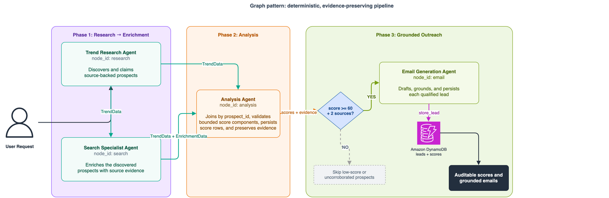
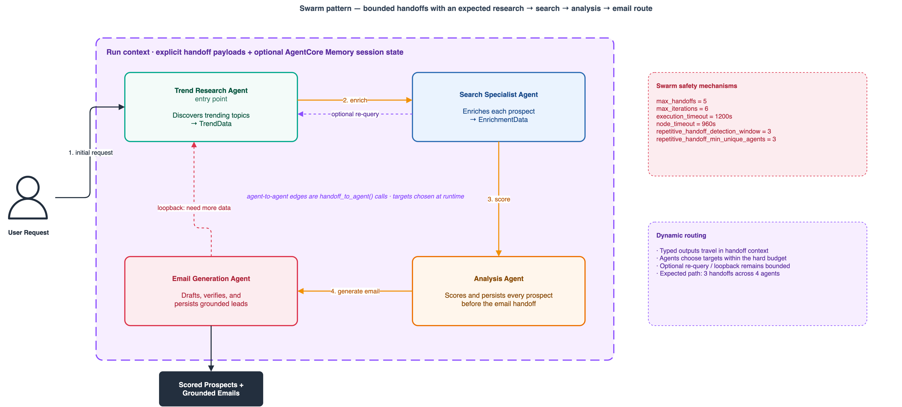

# Building Multi-Agent Social Intelligence with Strands Agents and Amazon Bedrock AgentCore

A multi-agent system built with [Strands Agents SDK](https://github.com/strands-agents/sdk-python) on [Amazon Bedrock AgentCore](https://aws.amazon.com/bedrock/agentcore/). It discovers qualified prospects, collects multi-signal trend data, scores relevance, and generates personalized outreach emails.

## Architecture Overview


The Streamlit demo and SDK callers invoke the Amazon Bedrock AgentCore Runtime with IAM credentials. The runtime hosts four Strands agents under either the Swarm or Graph orchestration pattern. Agents call Claude Sonnet 4.6 on Amazon Bedrock, can attach AgentCore Memory when the caller provides a session ID, and emit service and Strands OpenTelemetry data to Amazon CloudWatch. Tool calls travel over MCP through the AgentCore Gateway (IAM auth) to a single AWS Lambda handler that fans out to nine external APIs. Auditable score rows, verified email leads, and frontier claims persist to Amazon DynamoDB.

Deploy once, then test both orchestration patterns through the same endpoint. Diagram sources live in [`architecture/`](architecture/) as editable draw.io files.

## Key Features

- **4 specialized agents**: Graph uses Pydantic structured outputs; Swarm uses explicit JSON handoff context so agents can continue collaborating
- **9 API tools** behind a single Lambda: Hacker News, YouTube, dev.to, Wikipedia, GitHub, Lobste.rs, Product Hunt, Reddit, Stack Overflow
- **AgentCore Gateway** with IAM auth for MCP-based tool discovery (CDK L2 constructs)
- **AgentCore Runtime** for managed agent deployment (CDK L2 constructs)
- **Tool schema** as single source of truth for tool contracts
- **2 orchestration patterns**: Graph (deterministic DAG) and Swarm (autonomous handoffs), both able to attach orchestrator-level AgentCore Memory
- **DRY tool architecture**: shared handlers behind a single Lambda
- **AgentCore Memory**: created by the CDK stack, with session summaries and semantic brand recall when a caller supplies `session_id`; stateless otherwise
- **Optional model tiering**: per-agent model overrides (`TREND_MODEL_ID`, `SEARCH_MODEL_ID`, `ANALYSIS_MODEL_ID`, `EMAIL_MODEL_ID`) default to the documented Claude Sonnet 4.6
- **Bedrock Guardrails**: the CDK stack creates a guardrail and injects its ID and version into the deployed runtime
- **Frontier table**: agents can claim a prospect before processing it, reducing duplicate work across concurrent runs
- **Optional grounding threshold**: set `GROUNDING_MIN_SCORE` to block persistence of a low-grounding draft (`src/social_intelligence/tools/grounding_gate.py`)
- **Optional compliance footer**: set `COMPLIANCE_FOOTER_REQUIRED=true` to add an unsubscribe footer to rendered HTML email
- **Optional human review**: set `EMAIL_APPROVAL_REQUIRED=true` to store leads as `pending_review`; delivery is outside this sample's scope
- **Deterministic qualification**: an email draft must score at least 60 and cite at least two distinct supported sources; the Graph gate and `store_lead` both enforce this
- **Auditable scoring**: bounded category contributions and the ICP adjustment must recompute to the persisted 0-100 score in both Graph and Swarm flows
- **AgentCore Observability**: Strands built-in telemetry, Runtime tracing, and application/usage log delivery expose model, agent, and tool telemetry in CloudWatch
- **Quality eval harness**: `scripts/eval_quality.py` validates golden-scenario structure and grounding offline, or evaluates persisted live results against score/relevance/grounding thresholds
- **AWS CDK infrastructure** with cdk-nag security compliance

## Project Structure

```text
.
├── src/
│   └── social_intelligence/           # Main package (src layout)
│       ├── __init__.py
│       ├── config.py                      # Shared config (model ID, region)
│       ├── agents/
│       │   ├── trend_research_agent.py    # Prospect discovery + trend signals
│       │   ├── search_specialist_agent.py # Enrichment + competitive intel
│       │   ├── analysis_agent.py          # Scoring (0-100) + prioritization
│       │   └── email_generation_agent.py  # Personalized outreach + lead persistence
│       ├── tools/
│       │   ├── registry.py                # Tool route registry (add new tools here)
│       │   ├── _secrets.py                # Shared Secrets Manager helper
│       │   ├── _freshness.py              # Temporal decay weight helper
│       │   ├── hackernews.py              # Hacker News Firebase API
│       │   ├── youtube.py                 # YouTube Data API v3
│       │   ├── devto.py                   # dev.to (Forem) API
│       │   ├── _http.py                   # Shared HTTP retry helper
│       │   ├── wikipedia.py               # Wikipedia REST API
│       │   ├── github.py                  # GitHub Search API
│       │   ├── lobsters.py                # Lobste.rs JSON API
│       │   ├── producthunt.py             # Product Hunt GraphQL API
│       │   ├── reddit.py                  # Reddit JSON API (intent signal detection)
│       │   ├── stackoverflow.py           # Stack Exchange API (demand signals)
│       │   ├── brand_knowledge.py         # Brand KB (agent-side)
│       │   ├── dynamodb_tool.py           # Lead persistence + dedup (agent-side)
│       │   ├── grounding_gate.py          # Optional grounding check before persistence
│       │   └── email_renderer.py          # Jinja2 HTML email rendering (agent-side)
│       ├── orchestration/
│       │   ├── graph_runner.py            # CLI: invoke deployed agent (graph pattern)
│       │   ├── model_retry.py             # Bounded transient model retry hook
│       │   ├── qualification_gate.py      # Server-side score and source eligibility check
│       │   ├── swarm_runner.py            # CLI: invoke deployed agent (swarm pattern)
│       │   └── tool_budget.py             # Per-agent tool-call budgets
│       └── schemas/
│           ├── models.py                  # Pydantic inter-agent data contracts
│           └── tool_schema.json           # Deployed Gateway tool contract (single source of truth)
├── tests/                                 # Test suite
│   ├── conftest.py                        # Shared pytest fixtures
│   ├── test_tools.py                      # Unit tests for tool handlers
│   ├── test_producthunt.py                # Product Hunt tool tests
│   ├── test_hardening.py                  # Security hardening tests
│   ├── test_coverage.py                   # Coverage tests for previously-untested paths
│   ├── test_coverage_extra.py             # Additional hermetic coverage tests
│   ├── test_eval_quality.py               # Eval harness behavior
│   ├── test_model_retry.py                # Retry policy behavior
│   ├── test_tool_budget.py                # Tool budget behavior
│   └── integration/
│       └── test_runtime.py                # End-to-end AgentCore Runtime test
├── entrypoint.py                          # AgentCore Runtime entrypoint
├── pyproject.toml                         # Modern Python packaging
├── demo/
│   ├── app.py                             # Streamlit demo UI (main entry)
│   ├── config.py                          # Configuration, env loading, constants
│   ├── streaming.py                       # AgentCore streaming client + SSE parser
│   ├── components.py                      # Reusable UI rendering components
│   └── data.py                            # DynamoDB data layer + config checks
├── infra/
│   ├── app.py                             # CDK app entry point
│   ├── gateway_stack.py                   # CDK stack: AgentCore Gateway + IAM target
│   ├── cdk.json
│   ├── requirements.txt
│   ├── runtime-requirements.txt            # Generated frozen dependencies for AgentCore artifact
│   ├── stacks/
│   │   └── social_intelligence_stack.py   # CDK stack (Lambda + Gateway + Runtime)
│   └── lambda/
│       ├── handler.py                     # Lambda router (imports from tools/)
│       └── requirements.txt
├── scripts/
│   ├── benchmark.py                       # Load and latency benchmarks
│   ├── eval_quality.py                    # Quality evaluation harness (golden set)
│   └── test_invoke.py                     # Quick smoke test for deployed runtime
├── config/
│   └── icp_profile.json                   # Ideal customer profile configuration
├── eval/
│   └── golden_set.json                    # Evaluation prompts and acceptance thresholds
├── .env.example                           # Environment variable template
├── LICENSE
├── CONTRIBUTING.md
├── SECURITY.md
└── CODE_OF_CONDUCT.md
```

## Adding a New Tool

Follow the complete, tested workflow in [CONTRIBUTING](CONTRIBUTING.md#how-to-add-a-new-tool). It covers the handler, registry, Gateway tool schema, schema-to-route mapping when needed, and the role-specific allow-list.

## Prerequisites

- Python 3.14
- Node.js 22 or 24 LTS (required by the AWS CDK Toolkit)
- [AWS CLI v2](https://docs.aws.amazon.com/cli/latest/userguide/getting-started-install.html)
- [AWS CDK v2](https://docs.aws.amazon.com/cdk/v2/guide/getting-started.html) (`npm install -g aws-cdk@2.1131.0`)
- Access to Amazon Bedrock foundation models (Anthropic Claude)
- A target AWS Region where both Amazon Bedrock AgentCore and the selected Amazon Bedrock inference profile are available to your account

> **Cost warning:** You are responsible for the cost of the AWS services used while running this sample. Review the [Cost](#cost) section and current AWS pricing before deploying.

## Getting Started

> **Estimated time:** ~45–60 minutes (including CDK deployment)

### 1. Install dependencies

```bash
git clone https://github.com/aws-samples/sample-social-intelligence-agents.git
cd sample-social-intelligence-agents
python -m venv .venv
source .venv/bin/activate
python -m pip install -e ".[dev,infra]"
```

### 2. Deploy infrastructure

```bash
cd infra

# Set the deploy Region. AWS_REGION takes precedence over CDK_DEFAULT_REGION in the
# credential chain, so export AWS_REGION to be sure the stack lands where you intend.
export AWS_REGION=us-east-1
export CDK_DEFAULT_ACCOUNT=$(aws sts get-caller-identity --query Account --output text)
export CDK_DEFAULT_REGION=$AWS_REGION

cdk bootstrap
cdk deploy
cd ..
```

The default model is `global.anthropic.claude-sonnet-4-6`. Confirm model access in the target Region before deployment. To pin a different available profile or tier models per agent, export `MODEL_ID` (or `TREND_MODEL_ID`, `SEARCH_MODEL_ID`, `ANALYSIS_MODEL_ID`, `EMAIL_MODEL_ID`) before `cdk deploy`; the stack forwards them to the runtime. The stack also supplies the ID and published version of its Bedrock Guardrail. Runtime settings such as `EMAIL_SCORE_THRESHOLD`, `MIN_INDEPENDENT_SOURCES`, `GROUNDING_MIN_SCORE`, `EMAIL_APPROVAL_REQUIRED`, `COMPLIANCE_FOOTER_REQUIRED`, `ORCHESTRATION_NODE_TIMEOUT_SECONDS`, and `LOG_LEVEL` are forwarded when set.

CDK deploys everything in a single stack: the Lambda, API Gateway, AgentCore Gateway (IAM auth + Lambda target), AgentCore Runtime, AgentCore Memory, DynamoDB tables, a Bedrock Guardrail, and four CMK-encrypted Secrets Manager secrets. No separate gateway setup script is needed.

### 3. Populate API credentials (optional)

The CDK stack creates the secrets empty and CMK-encrypted. The sample runs with zero credentials (the tools fall back to unauthenticated requests), so this step is optional. To enable authenticated calls, set values WITHOUT routing them through CloudFormation or git:

```bash
# YouTube Data API key (raises YouTube tool reliability)
aws secretsmanager put-secret-value \
  --secret-id social-intel/youtube-api-key --secret-string "YOUR_YOUTUBE_API_KEY"

# Optional: GitHub token (raises GitHub rate limit 60 -> 5000 req/hr)
aws secretsmanager put-secret-value \
  --secret-id social-intel/github-token --secret-string "YOUR_GITHUB_PAT"

# Optional: Reddit OAuth2 client credentials (JSON)
aws secretsmanager put-secret-value \
  --secret-id social-intel/reddit-oauth \
  --secret-string '{"client_id":"...","client_secret":"..."}'

# Optional: Product Hunt API token
aws secretsmanager put-secret-value \
  --secret-id social-intel/producthunt-api-token --secret-string "YOUR_PH_TOKEN"
```

The exact secret names are in the `ApiSecretNames` CDK stack output.

### 4. Invoke

```bash
export AGENTCORE_AGENT_ARN=<RuntimeArn from CDK output>
python -m social_intelligence.orchestration.graph_runner "Find recent AI tool launches"
python -m social_intelligence.orchestration.swarm_runner "Deep-dive on AI agent frameworks"
```

The runtime payload accepts `session_id` and `actor_id` to attach AgentCore Memory. For long-running clients, set `background: true`; the runtime returns `async_started`, completes server-side, and persists results under `run_id`. Read results from DynamoDB after the terminal run marker rather than relying on a long-lived response stream.

### 5. Run evaluation

```bash
# No AWS credentials required
python scripts/eval_quality.py --offline

# Deployed runtime smoke test; use EVAL_PATTERN=both to exercise both orchestrators
AGENTCORE_AGENT_ARN=<RuntimeArn> EVAL_PATTERN=both python scripts/eval_quality.py --live --limit 1
```

Offline evaluation validates `eval/golden_set.json` and production grounding logic using synthetic evidence. Live evaluation starts background runs, waits for a successful terminal marker, reads DynamoDB results by `run_id`, and checks top scores or LLM-judged email relevance and grounding.

### 6. Configure observability and benchmark

AgentCore Runtime tracing is enabled by the stack. Strands emits OpenTelemetry spans
natively, and AgentCore Runtime exports them without a second application launcher. To
search service and Strands spans, enable CloudWatch Transaction Search once in the
account before invoking the runtime. Follow the
[AgentCore observability setup](https://docs.aws.amazon.com/bedrock-agentcore/latest/devguide/observability-configure.html)
to add the required X-Ray resource policy and set the trace destination to
`CloudWatchLogs`.

```bash
export AGENTCORE_EVENT_LOG_GROUP=$(aws cloudformation describe-stacks \
  --stack-name SocialIntelligenceStack \
  --query "Stacks[0].Outputs[?OutputKey=='RuntimeApplicationLogGroupName'].OutputValue" \
  --output text)

# Tokens are read from Strands spans after one 300-second ingestion wait.
# Supply current model-specific pricing only when a cost calculation is required.
python scripts/benchmark.py --prospects 50 \
  --input-cost-per-million <current-input-usd-rate> \
  --output-cost-per-million <current-output-usd-rate>
```

The benchmark rejects streams without `multiagent_result`, writes per-run latency,
token, and optional cost data to `benchmark_results.csv`, and creates
`benchmark_human_review.csv` when `LEADS_TABLE_NAME` is set. Two reviewers score
relevance, personalization, and grounding from each persisted draft and its recorded
evidence. Strands spans commonly take three to five minutes to appear.

### 7. Run the Streamlit demo (optional)

```bash
pip install -e ".[demo]"
cp .env.example .env
# Edit .env: set AGENTCORE_AGENT_ARN and AWS_DEFAULT_REGION from CDK outputs
streamlit run demo/app.py
```

The demo connects to the deployed AgentCore Runtime and streams agent events in real time. It reads leads from DynamoDB and renders HTML email previews.

### 8. Existing DynamoDB table migration

The CDK stack creates the leads table and its three required GSIs automatically.
For an older deployed stack that has none of these indexes, keep CloudFormation
as the owner and deploy one additive stage at a time:

```bash
cd infra
export GSI_MIGRATION_STAGE=1
cdk deploy
# Wait until product-name-index is ACTIVE before continuing.
export GSI_MIGRATION_STAGE=2
cdk deploy
# Wait until dedup-partition-discovered-at-index is ACTIVE before continuing.
export GSI_MIGRATION_STAGE=3
cdk deploy
unset GSI_MIGRATION_STAGE
```

Never create the indexes manually before deployment. The staged setting is only
for forward migrations; do not lower it after a later stage has been deployed.

## Orchestration Patterns: Graph vs Swarm

| | Graph (default) | Swarm |
|---|---|---|
| Control flow | Deterministic DAG | Autonomous handoffs |
| Execution order | Predictable: research → search → analysis → email | Dynamic: agents self-organize |
| Parallelism | Sequential dependency: search receives the exact research prospects | Sequential handoffs |
| Conditional logic | Explicit edge conditions (score ≥ 60 and ≥2 independent sources gate email) | Persistence rejects unqualified drafts |
| Structured output | Enabled (Pydantic models enforce contracts) | Disabled (would block handoffs) |
| Token efficiency | Higher (skips email for low-score prospects) | Lower (agents may revisit work) |
| Safety | DAG prevents cycles | Ping-pong detection (window=3, min 3 unique) |
| Best for | Production pipelines with known workflows | Exploratory, open-ended research |

**Implementation note:** In Swarm mode, `structured_output_model` is disabled on individual agents because Strands treats structured output as a task-completion signal. With it enabled, an agent would stop instead of handing off to the next specialist. Swarm validates its score-persistence payload and validates lead data again at the persistence boundary. Graph keeps `structured_output_model` enabled because each node runs to completion before the next one starts.

Both patterns run the same four agents; the diagrams below show only the flow topology, and the tables that follow give the per-agent detail.

### Agents, tools, and outputs

| Agent | node_id | Tools | Output |
|---|---|---|---|
| Trend Research | `research` | `hackernews_trending`, `youtube_trending`, `devto_trending`, `producthunt_trending`, `reddit_search`, `stackoverflow_search`, `check_existing_leads`, `claim_url` | `TrendData` |
| Search Specialist | `search` | `wikipedia_summary`, `github_search`, `lobsters_trending`, `stackoverflow_search`, `check_existing_leads` | `EnrichmentData` |
| Analysis | `analysis` | `persist_scored_prospects` in Swarm mode | `ScoredProspectList` |
| Email Generation | `email` | `retrieve_brand_knowledge`, `render_email_html_tool`, `verify_email_claims`, `store_lead` | `EmailDraftList` in Graph; both modes persist verified leads |

The Analysis agent scores each prospect 0–100 on Claude Sonnet 4.6. Freshness multipliers affect individual category contributions but cannot exceed the category cap; an ICP adjustment (+10 strong, 0 medium, -10 weak) is then applied and the final score is clamped to 0–100. `ScoreBreakdown` carries those values, and Pydantic rejects any Graph output or Swarm persistence payload whose stored total does not equal the recomputed result:

| Scoring dimension | Max points |
|---|---|
| Topical alignment | 25 |
| Timing relevance | 20 |
| Engagement potential | 20 |
| Intent signals | 20 |
| Data quality | 15 |

### Graph pattern



The Graph pattern runs a deterministic DAG. Research emits `TrendData`; Search receives that output and returns matching `EnrichmentData`; Analysis then joins both by `prospect_id`. The `ScoredProspectList` contract retains source-backed evidence for the email stage. `_score_above_threshold()` only enters email generation when at least one prospect meets `EMAIL_SCORE_THRESHOLD` (default 60) and `MIN_INDEPENDENT_SOURCES` (default 2). `store_lead` repeats that check for every draft, so an unqualified prospect cannot persist an email. Long runs should use background invocation so this correct data dependency does not depend on a persistent SSE connection. Graph configuration: `set_execution_timeout(1200)`, `set_max_node_executions(20)`, `set_node_timeout(960)` by default. The node budget automatically rises when `BEDROCK_READ_TIMEOUT_SECONDS` is increased, preserving the three-attempt retry contract.

For long runs, invoke with `{"background": true}`: the runtime executes the pipeline as an Amazon Bedrock AgentCore async task (reporting `HealthyBusy` so the session is not idle-terminated) and returns an `async_started` acknowledgment immediately. Results persist to Amazon DynamoDB, so callers read them back by `run_id` rather than holding a minutes-long streaming connection. Interactive clients that want live events omit `background` and consume the SSE stream as usual.

### Swarm pattern



The Swarm pattern lets each agent choose its own handoff target via `handoff_to_agent()`. Agents pass complete `TrendData`, `EnrichmentData`, and scored evidence through explicit handoff context, so downstream stages never depend on hidden tool-call history. The expected route is research → search → analysis → email; optional re-query and loopback remain possible within hard limits. Safety knobs (`max_handoffs=5`, `max_iterations=6`, `execution_timeout=1200s`, `node_timeout=960s` by default, and repetitive-handoff detection over a window of 3 with 3 minimum unique agents) bound the run.

## Tool Architecture

```text
src/social_intelligence/schemas/tool_schema.json  ← Deployed tool contract (single source of truth)
        │
        └──→ AgentCore Gateway    (discovers tools)

src/social_intelligence/tools/<name>.py        ← Shared tool handlers
        │
        └──→ infra/lambda/handler.py   (Lambda router via tools/registry.py)
```

## Cost

You are responsible for the cost of the AWS services used while running this solution. Actual cost depends on the selected model, token volume, tool calls, DynamoDB usage, and Region. Review current AWS pricing for your target Region before deployment.

We recommend creating a budget through [AWS Cost Explorer](https://aws.amazon.com/aws-cost-management/aws-cost-explorer/) to monitor spending.

## Cleanup

The stack uses an env-gated removal policy. Stateful resources (DynamoDB tables, KMS key, Secrets Manager secrets) are RETAINED by default and DESTROYED only when `CDK_ENV=dev`. For a full teardown of a throwaway environment:

```bash
cd infra
CDK_ENV=dev cdk destroy --all
```

This removes the Lambda, API Gateway, AgentCore Gateway/Runtime/Memory, DynamoDB tables, the Bedrock Guardrail, the KMS key, and the four Secrets Manager secrets the stack created. Without `CDK_ENV=dev`, the secrets, tables, and key are retained; delete them manually if you want them gone:

```bash
for s in youtube-api-key producthunt-api-token github-token reddit-oauth; do
  aws secretsmanager delete-secret --secret-id "social-intel/$s" --force-delete-without-recovery
done
```

**Verify cleanup:**

```bash
# Confirm stack deletion
aws cloudformation describe-stacks --stack-name SocialIntelligenceStack --region "$AWS_REGION"
# Should return: "Stack not found"

# Check for ongoing charges
# Visit AWS Cost Explorer: https://aws.amazon.com/aws-cost-management/aws-cost-explorer/
```

## Troubleshooting

| Issue | Likely Cause | Quick Fix |
|---|---|---|
| `ModuleNotFoundError: social_intelligence` | Package not installed in editable mode | Run `pip install -e .` from project root |
| Gateway returns 403 Forbidden | IAM auth not configured for the caller | Verify `aws sts get-caller-identity` matches the account. Re-run `cdk deploy`. |
| `bedrock-agentcore` import fails | Missing optional dependency | Run `pip install "bedrock-agentcore[strands-agents]"` |
| YouTube tool returns empty results | Missing or expired API key | Check `aws secretsmanager get-secret-value --secret-id social-intel/youtube-api-key` |
| Streamlit shows "No leads yet" | DynamoDB table missing or pipeline not run | Deploy CDK stack (creates table), then run a pipeline |
| Streamlit shows config errors | Missing `.env` file | Copy `.env.example` to `.env` and fill in `AGENTCORE_AGENT_ARN` |
| `store_lead` returns ResourceNotFoundException | DynamoDB table not in the deployment region | Redeploy CDK stack or create table manually (see Getting Started) |

## Responsible Use

This sample demonstrates AI-powered prospect discovery and outreach using publicly
available data. When adapting this system:

- Only collect and process publicly available information
- Comply with applicable data protection regulations (GDPR, CCPA, etc.)
- Include opt-out mechanisms in all outreach communications
- Do not use this system for surveillance, social scoring, or profiling
- Review generated emails before sending; do not automate sending without human oversight
- Respect platform terms of service when collecting data from third-party APIs

## Contributing

See [CONTRIBUTING](CONTRIBUTING.md) for guidelines on reporting bugs, submitting pull requests, and adding new tools.

## Security

- IAM authentication on all endpoints (AgentCore Gateway, API Gateway)
- Secrets Manager for API keys (not hardcoded)
- Least-privilege IAM with specific resource ARNs
- cdk-nag AWS Solutions checks during synthesis
- CloudWatch logging for Lambda, API Gateway, and AgentCore Runtime application/usage logs; AgentCore service and Strands traces are enabled
- Input validation and sanitization in all tool handlers (length limits, allowed values, regex filtering). User prompts are passed to Amazon Bedrock models via parameterized API calls.
- The default CDK deployment supplies Bedrock Guardrail configuration to every agent call; standalone runs require both `GUARDRAIL_ID` and `GUARDRAIL_VERSION`
- Outbound HTTP from the tool Lambda restricted to an allow-list of known source-API hostnames, blocking SSRF attempts against internal AWS metadata endpoints
- DynamoDB leads and frontier tables encrypted with a customer-managed KMS key; TTL configured to expire records after 365 days

See [SECURITY](SECURITY.md) for reporting and architecture details.

## License

This library is licensed under the MIT-0 License. See the [LICENSE](LICENSE) file.
